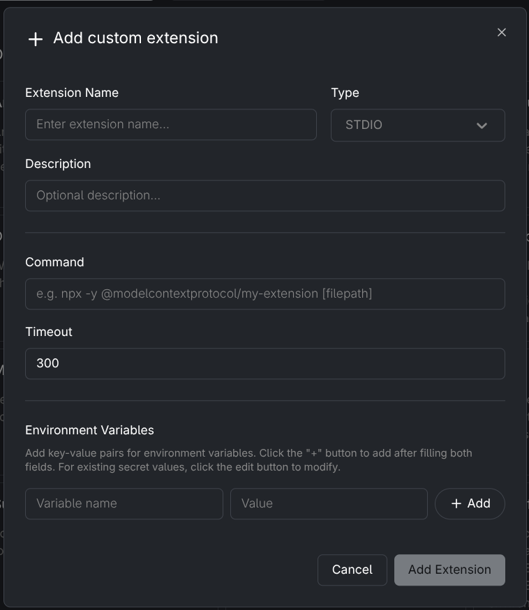

# signal-mcp

A self-hosted MCP server that gives any AI agent bidirectional access to Signal Messenger. Contacts message a dedicated Signal number; the gateway routes conversations to an AI agent (Goose, Claude CLI, or any MCP client) and streams replies back. Agents can also send messages proactively and read inbound messages directly via MCP tools.

Built around [signal-cli](https://github.com/AsamK/signal-cli). Goose Desktop integration uses [Goose](https://github.com/block/goose).

> **Status:** Prototype. Core loop is fully implemented and smoke-tested. See [Current limitations](#current-limitations).

---

## What it does

**Inbound (Signal → Agent)**
A message arrives on Signal → the gateway picks it up → creates or resumes a Goose session → streams the reply back to Signal. Read receipts (filled double-ticks) fire immediately on receipt. Typing indicators show while Goose is thinking.

**Outbound (Agent → Signal)**
Any MCP-compatible client (Goose Desktop, Claude Desktop, Cursor, etc.) can connect to the gateway's MCP endpoint and send Signal messages, list known contacts, or query the gateway identity — directly from a chat session.

---

## Architecture

```
Signal (phone)
      │
      ▼
signal-cli daemon (HTTP, 127.0.0.1:8080)
      │  SSE event stream
      ▼
signal-mcp                          ← this repo
      │  ├─ REST + SSE (goosed API)          inbound path
      │  └─ MCP server (port 7322)           outbound path
      │            │
      │            ├──────────────────► Goose Desktop
      │            │                    └─ goosed ──► Mistral / OpenAI / etc.
      │            │
      │            └──────────────────► Claude CLI
      │                                 └─ claude ──► Claude (Anthropic)
      │
      ▼
Signal (phone)   ◄── replies via signal-cli
```

---


## Prerequisites

**Linux only** — goosed discovery reads `/proc`. macOS/Windows not supported.

| Requirement | Version | Install |
|-------------|---------|---------|
| Java | 21+ | `sudo dnf install java-21-openjdk` |
| signal-cli | 0.13+ | `sudo dnf install signal-cli` |
| Python | 3.12+ | managed by `uv` |
| uv | any | `curl -LsSf https://astral.sh/uv/install.sh \| sh` |
| Goose Desktop | latest | [github.com/block/goose](https://github.com/block/goose) — optional, for Goose-based inbound replies |

---

## Install

```bash
git clone https://github.com/theronconrey/signal-mcp
cd signal-mcp
uv sync
```

---

## Setup

Complete these steps once, in order.

**1. Register a dedicated Signal number with signal-cli**

The gateway needs its own phone number — a SIM, second number, or VoIP number (e.g. Google Voice). This is separate from your personal Signal account.

```bash
signal-cli --account +1XXXXXXXXXX register
# Signal sends an SMS verification code to that number
signal-cli --account +1XXXXXXXXXX verify <code>
```

**2. Start the signal-cli daemon**

```bash
signal-cli --account +1XXXXXXXXXX daemon --http 127.0.0.1:8080
```

Or install it as a persistent user service (replace `+1XXXXXXXXXX` with your bot number):

```bash
systemctl --user enable --now signal-cli@+1XXXXXXXXXX
```

**3. Run the setup wizard**

```bash
uv run goose-signal setup
```

The wizard checks prerequisites, asks for your bot number and access policy, and writes `~/.config/goose-signal-gateway/config.yaml`. It prints ready-to-paste connection commands for Claude CLI and Goose Desktop — save the agent key it displays.

**4. Start the gateway** (start Goose Desktop first if you want inbound AI replies via goosed):

```bash
uv run goose-signal start --detach   # installs + starts as a systemd user unit
```

**5. Verify**

```bash
uv run goose-signal doctor
```

All checks green means you're ready. Send a message to your bot number from Signal to test.

---

## Running

```bash
# Status
goose-signal status

# Follow logs
goose-signal logs -f

# Stop
goose-signal stop

# Foreground (debug)
goose-signal start
```

---

## Pairing

The default access policy (`pairing`) requires unknown senders to be approved before the bot will respond.

When an unknown number messages the bot they receive a pairing code. The operator approves it:

```bash
uv run goose-signal pairing list                  # show pending codes
uv run goose-signal pairing approve ABCD23        # approve
uv run goose-signal pairing deny ABCD23           # reject
uv run goose-signal pairing revoke +16125551234   # remove approved sender
```

Once approved, the sender can converse with Goose — and Goose can message them back via the MCP `send_signal_message` tool.

---

## Connecting an MCP client

The setup wizard prints ready-to-paste connection instructions. The auth header is `Authorization: Bearer <agent_key>` for all clients.

### Claude CLI

```bash
claude mcp add signal-gateway http://127.0.0.1:7322/mcp \
  --header "Authorization: Bearer <agent_key>"
```

### Goose Desktop Extension

1. Select **Extensions** in the left column
2. Click **Add custom extension**
3. Fill in the fields as follows:



| Field | Value |
|-------|-------|
| Extension Name | `Signal MCP` |
| Type | `Streamable HTTP` *(change from the default STDIO)* |
| Endpoint | `http://127.0.0.1:7322/mcp` |
| Header name | `Authorization` |
| Header value | `Bearer <agent_key>` *(printed by `goose-signal setup`)* |

4. Click **Add Extension**

### Multi-agent (party line)

Add multiple entries under `mcp.agents` in `config.yaml` — each agent gets its own named key. `get_signal_identity` returns `"mode": "multi"` when more than one agent is configured.

### Available tools

| Tool | Description |
|------|-------------|
| `get_signal_identity` | Returns the Signal account, mode (`single`/`multi`), and whether goosed is connected |
| `list_signal_contacts` | Lists contacts with active sessions (numbers any agent can message) |
| `send_signal_message(phone_number, message)` | Sends a Signal message to a known contact |
| `get_messages(phone_number?, since?)` | Returns buffered inbound messages; optionally filter by sender or timestamp (ms) |

**Contact gating:** a phone number must initiate a conversation through the gateway (passing the pairing flow) before the agent can message them. The agent cannot cold-call arbitrary numbers.

**Buffer note:** `get_messages` reads from an in-memory buffer (500 messages per contact). The buffer resets on gateway restart — it is not persisted to disk.

---

## Security posture

- **Pairing is the default for a reason.** `open` DM policy gives anyone with your bot number shell-level access via Goose tool use.
- **Tool approval routes to Signal.** When Goose wants to run a shell command, the gateway sends a yes/no prompt to Signal. You must reply before it proceeds.
- **MCP auth uses per-agent keys.** Each entry under `mcp.agents` in `config.yaml` grants full Signal send access. Treat each key like a password.
- **The gateway has shell access.** Treat `~/.config/goose-signal-gateway/config.yaml` like root credentials.
- **signal-cli key material** is at `~/.local/share/signal-cli` — mode `0700`. Do not expose it.

---

## Current limitations

- **Linux only** — goosed discovery reads `/proc`; macOS/Windows not supported.
- **Desktop session sidebar** — gateway sessions appear in Goose Desktop's sidebar only after a Desktop restart (`loadSessions()` runs at startup; there is no push notification for externally-created sessions). Upstream fix needed: a `sessionCreated` WebSocket event from goosed.
- **Desktop real-time message updates** — when the gateway injects a message into an already-open session via `POST /reply`, the Desktop UI does not refresh to show the new exchange. goosed does not broadcast session writes to existing UI subscribers. Workaround: close and reopen the session in Desktop to reload the full history. Upstream fix needed: a `sessionUpdated` WebSocket event (or shared SSE broadcast) from goosed.
- **goosed port changes on restart** — goosed binds to a random port each time Goose Desktop starts. The gateway polls for reconnection every 30 seconds and prefers the `GOOSE_PORT` env var when set. Messages received while goosed is down are buffered and available via `get_messages`; automatic replies are held until reconnection.
- **No session history replay** — goosed v1.30.0 has no history endpoint; restarting the gateway starts fresh sessions.
- **No `resolve_permission` via ACP** — the tool-approval flow sends a Signal prompt but the ACP handshake cannot complete (goosed v1.30.0 limitation).
- **One session per sender** — no threads or topics within a DM conversation.
- **Text only** — no voice, video, reactions, or attachments.
- **signal-cli 0.14.2 quirks** — `editMessage` and `sendReadReceipt` not implemented in the HTTP daemon; workarounds are in place (see `docs/`).

---

## Project structure

```
src/goose_signal_gateway/
├── acp_client.py      # goosed REST/SSE client
├── approvals.py       # Signal-side tool-approval flow
├── cli.py             # goose-signal CLI entry point
├── config.py          # config model + YAML load/save
├── dedup.py           # message deduplication
├── gateway.py         # main loop: receive → session → stream → reply
├── goosed_client.py   # goosed process discovery (/proc + GOOSE_PORT env)
├── message_buffer.py  # in-memory per-contact message buffer (500 msg cap)
├── mcp_server.py      # MCP HTTP server (signal tools, per-agent Bearer auth)
├── pairing.py         # sender pairing handshake
├── session_map.py     # persistent Signal conversation → session_id map
└── signal_client.py   # signal-cli HTTP client (send, typing, receipts, SSE)

systemd/
├── goose-signal-gateway.service   # user unit for the gateway
└── signal-cli.service             # reference unit for signal-cli daemon

docs/
├── acp-findings.md          # goosed API contract notes
├── desktop-integration.md   # Desktop session visibility investigation
└── mcp-server-research.md   # MCP direction research and Goose Desktop internals
```

---

## License

MIT
